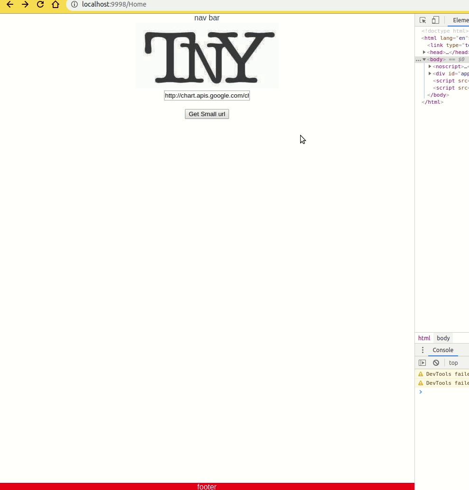

# Hash mechanism
## Goal: create random 6 letter char that are unique , try to avoid collision , and collision checking on the db side.
## idea 1 
- use crc32 hash initially to generate unique 32bit value  based on the url
- 32bits >= base64url encoding =>  6 letters
- insert into db 6 letters
    -if collision
        then use random generator to make random 6 letter

Crc32 thoretical unique values is ~4 billion but ,unfortunely after studying crc32 and its limits around 77k entries the probability of collision is 1 in 2. 


## idea 2
- use sha256 hash initally to generate unique 256bit value based on the url
- pick 32bits randomly >= base64url encoding => 6 letters
- insert into db 6 letters
    -if collision
        then use random generator to make random 6 letter

## idea 3
- use random string generator to make 6 letters
........ same steps as idea2

IO operations are more expensive in terms of time. Therefore idea 2 resolves this issue by first trying a calculated random key.

## idea 4
- use counter to just count up 1 and use that as a unique key

counters would out grow range and the url would become long again :/.
Harder to turn into a distributed system.

## idea 5
- same as idea 2 but use md5 reason:
    * md5 is faster , security doesnt matter

# Storage and persistent layer
## Storage systems : Mongodb ,redis
implemented timeouts(ttl) on both levels

# How to install and run 
- Please add '127.0.0.1       gohashnode' to your /etc/hosts file.
- run ```docker-compose up ```


# Tech Stack
- golang
- VueJS
- Redis
- Mongo
- Docker
- docker-compose

# demo
